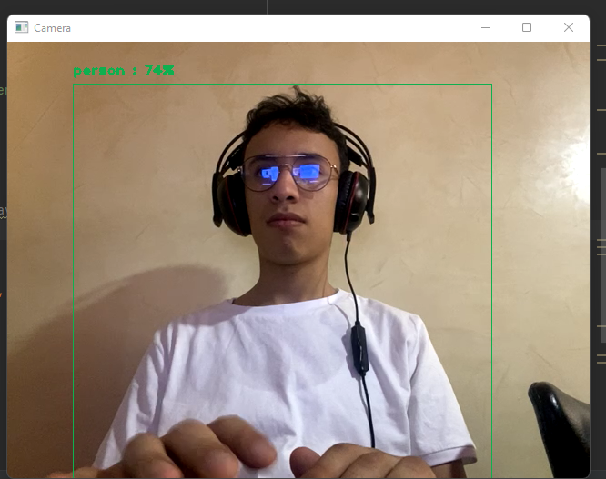
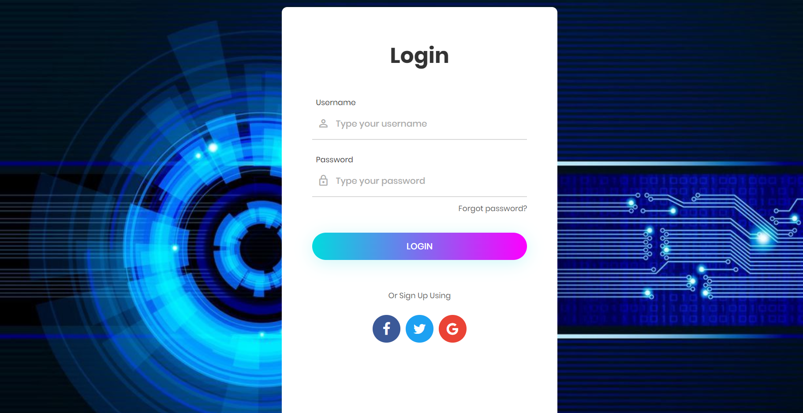
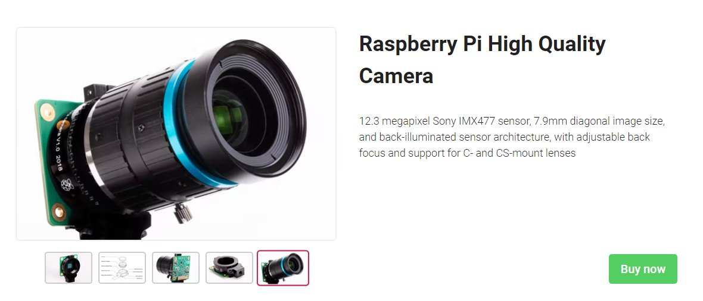
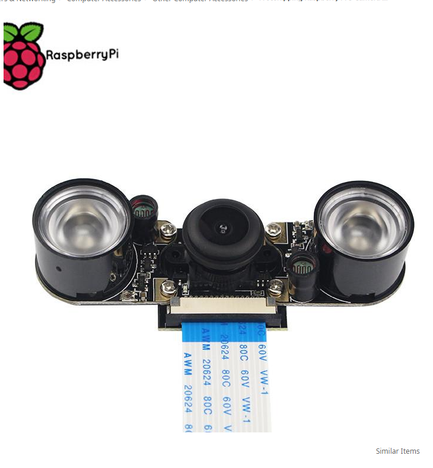
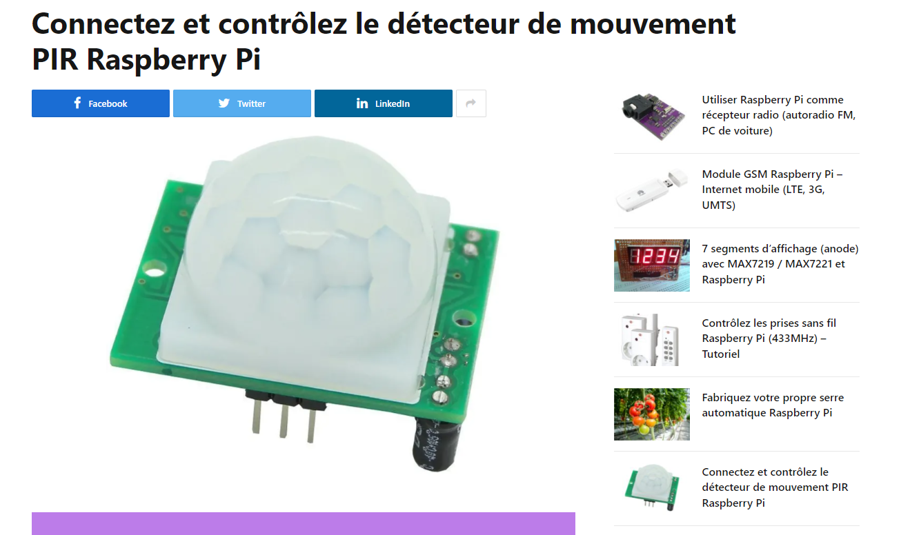
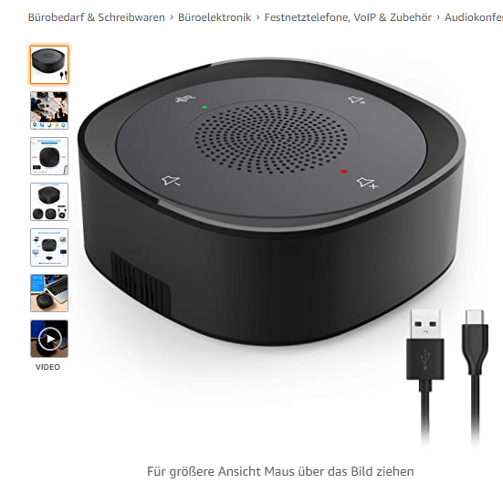

# Power Security

## Concept
>This project is about a camera, that using SDD_MOBILE_NET and haarcascade detector of opencv.it should be installed on a Server. The camera is implemented for child in school, there parent could upload a picture of person that should take the child from school to home, and it will be easy way to set the person who have right to take kids from school with just a website.
## Demonstration
>This the bounding box of my personality

>This my server platform, send to the parents

## Requirement
##### You will need a computer who will play the role of the server and process messages(Raspberry pi 4 is good), you will need a camera,then a speeker to play alarm role, then a microphone because we will speak with the person
#### Requirement for professional building
##### Raspberry Pi 3 Camera Night Vision with 150-degree Wide Angle 5M Pixel 1080 P LED Flashlight Camera Module
>Best resolution

>Raspberry Pi 3 Camera Night Vision with 150-degree Wide Angle 5M Pixel 1080 P LED Flashlight Camera Module

>Solar panel

>2 x détecteur de mouvement PIR Raspberry Pi

>Speaker and Microphone

